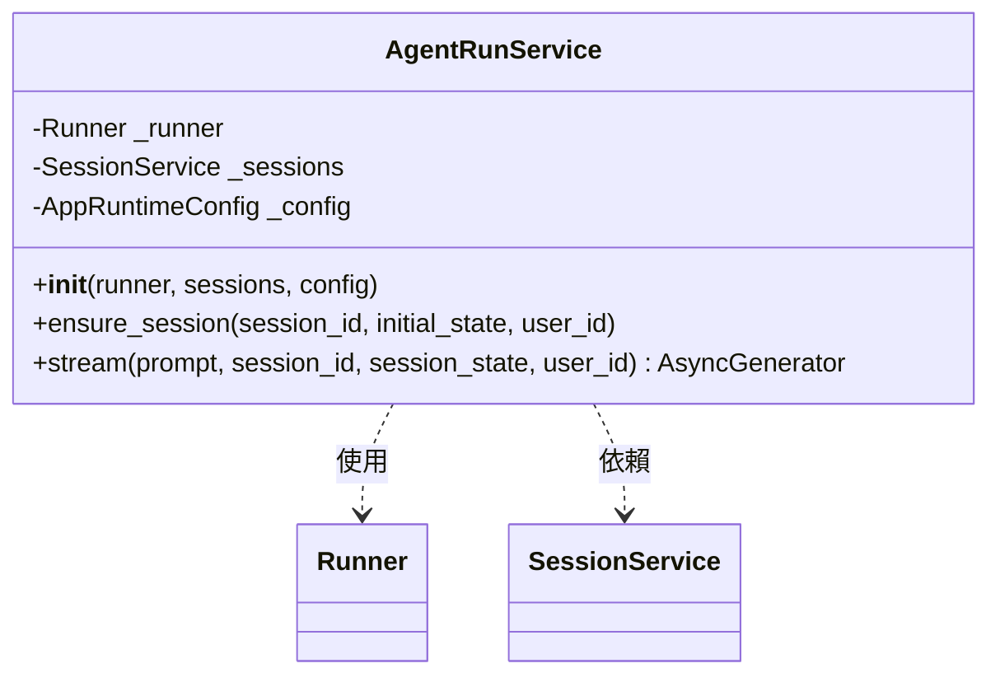
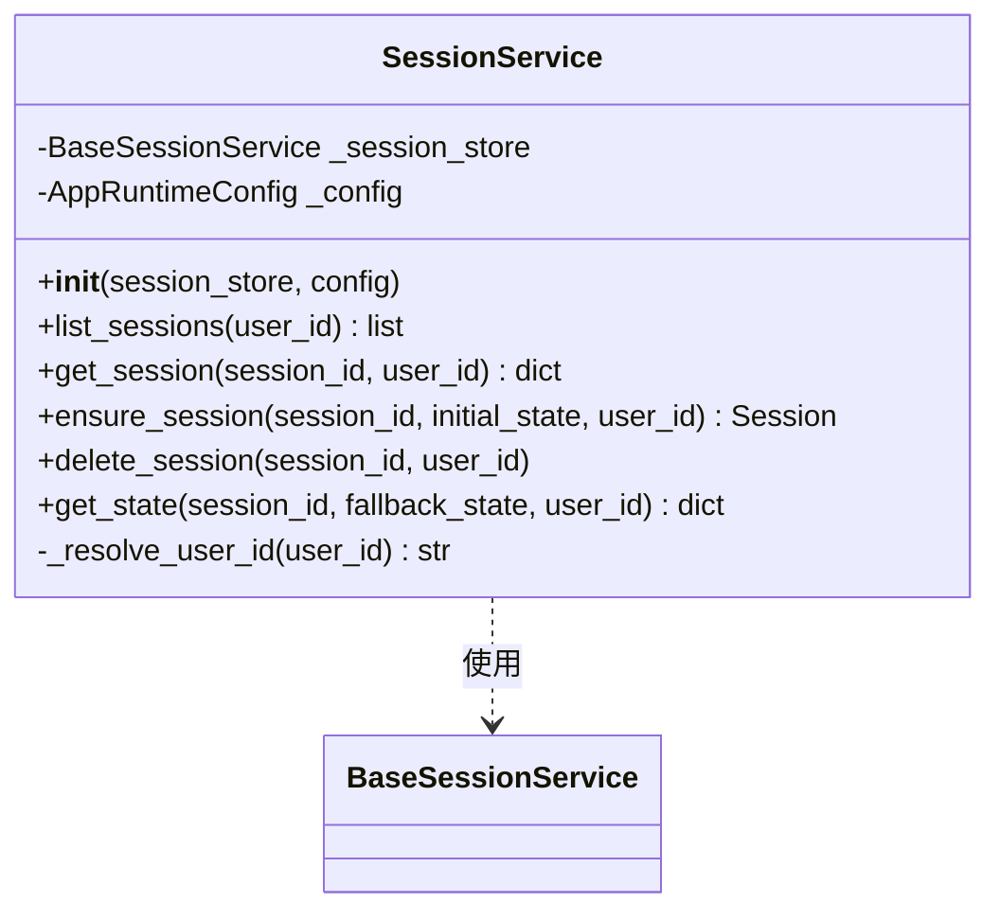
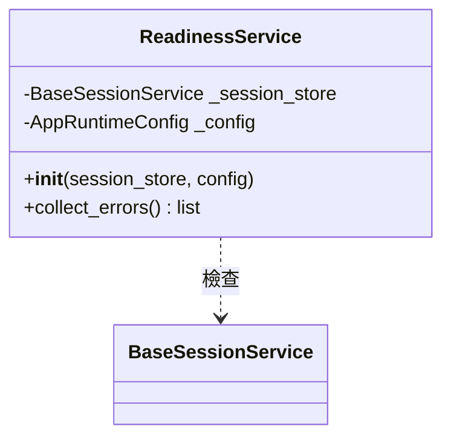

# Services 模組說明

本目錄包含應用程式的核心服務層，負責處理業務邏輯、與 AI Agent Runtime 互動以及管理使用者對話狀態。

## 類別圖 (Class Diagrams)

### AgentRunService
負責與 Google ADK Runner 互動，處理串流回應與狀態合併。

### SessionService
負責對話視窗 (Session) 的生命週期管理與持久化狀態操作。

### ReadinessService
負責檢查系統各項依賴服務的就緒狀況。

---

## 詳細服務說明與函式呼叫

### 1. AgentRunService (`agent_run_service.py`)

管理 Agent 的執行生命週期，並將 ADK 的原始事件轉換為前端所需的通訊協定封包。

#### 核心方法：
- **`stream(...)`**:
  - **描述**: 與 Agent 進行互動的主入口。
  - **呼叫**: `async for envelope in agent_run_service.stream(prompt="...", session_id="...")`
  - **流程**:
    1. 發送 `meta` 封包告知傳輸模式。
    2. 調用 ADK Runner 開始異步迭代事件。
    3. 過濾掉重複的使用者回顯輸入。
    4. 將 ADK `Event` 轉換為多個 `envelopes`（包含文字串流、工具調用、狀態更新）。
    5. 彙整並更新最新的 Session 狀態。
    6. 最後發送 `done` 封包，附帶最終完整回覆與最新狀態。

#### 內部輔助函式：
- `map_adk_event_to_envelopes(event, sequence)`: 將單一 ADK 事件拆解為 timeline、message 與 state 封包。
- `is_echoed_user_input(event, prompt)`: 檢查是否為 ADK 重複拋出的使用者訊息。
- `merge_state_patches(current_state, envelopes)`: 從封包流中即時提取並合併狀態變動。

---

### 2. SessionService (`session_service.py`)

封裝了對底層 Session 存儲的操作，提供一致的資料結構給 API 層。

#### 核心方法：
- **`list_sessions(user_id)`**:
  - **描述**: 獲取使用者的所有歷史對話。
  - **回傳**: 經過格式化與時間排序後的字典列表。
- **`ensure_session(session_id, ...)`**:
  - **描述**: 確保對話容器存在（冪等性操作），常用於啟動新對話前。
- **`get_state(session_id, fallback_state, ...)`**:
  - **描述**: 獲取 Session 狀態。若提供 `fallback_state`（記憶體中較新的狀態），則會進行合併。

#### 資料轉換函式：
- `to_session_list_item(session)`: 將 ADK 原始 Session 物件映射為包含 `title`, `updatedAt`, `state` 的 UI 結構。
- `format_updated_at(timestamp)`: 將時間戳記轉為「3 分鐘前」、「昨天」等相對文字。
- `safe_stringify(value)`: 處理狀態值在存儲前的字串序列化。

---

### 3. ReadinessService (`readiness_service.py`)

系統自檢工具，用於環境初始化或健康檢查介面。

#### 核心方法：
- **`collect_errors()`**:
  - **描述**: 同時檢查 Session Store (DB) 與 Toolbox Server (外部 API) 的可用性。
  - **機制**: 使用 `asyncio.to_thread` 處理同步請求，避免阻塞事件迴圈。
  - **回傳**: 若一切正常，回傳空列表；否則包含詳細錯誤訊息。

---

## 檔案清單
- `agent_run_service.py`: Agent 執行與事件封裝轉換服務。
- `session_service.py`: 對話 Session 管理服務。
- `readiness_service.py`: 系統就緒檢測服務。
- `__init__.py`: 模組導出。
