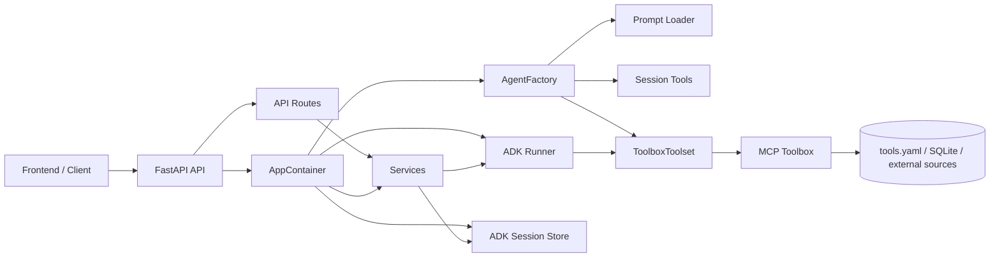

# 系統架構說明

本文件描述目前保險推薦代理後端的實際模組切分、依賴方向與請求流程。

目前的設計目標是：

* 後端結構簡潔
* FastAPI 只負責 HTTP 邊界
* Agent 建立流程集中管理
* 業務邏輯集中在 service 層
* 工具與 prompt 保持獨立且可替換

---

## 一、目前目錄結構

目前後端核心目錄如下：

```text
app/
  agent.py
  config.py
  container.py
  session_state.py
  api/
    dependencies.py
    main.py
    schemas.py
    sse.py
    routes/
      run.py
      sessions.py
  services/
    agent_run_service.py
    readiness_service.py
    session_service.py
  tools/
    session_tools.py
  prompts/
    insurance_agent_prompt.txt
```

### 模組關係圖



---

## 二、模組責任

### 1. config

app/config.py 負責：

* 讀取環境變數
* 建立 AppRuntimeConfig
* 提供 runtime 設定給 container、agent 與 services

這一層只處理設定，不負責任何業務流程。

---

### 2. container

app/container.py 是後端組裝中心，負責：

* 建立 ADK Agent
* 建立 session store
* 建立 ADK Runner
* 建立 session、agent run、readiness 等 services
* 聚合成 AppContainer

這一層只做依賴組裝，不承擔 HTTP 邏輯，也不承擔對話邏輯。

---

### 3. agent

app/agent.py 是正式且唯一的 Agent 建立入口，負責：

* 建立 ToolboxToolset
* 組合 session tools
* 建立 ADK Agent
* 提供 AgentFactory 與 create_agent()
* 載入 agent prompt 檔案

這樣 agent 建立邏輯維持在單一檔案，後續如果要替換 model、toolbox 或 prompt 載入策略，只需要改 app/agent.py。

---

### 4. api

app/api/ 專注在 FastAPI 的 HTTP 邊界。

#### main.py

負責：

* 建立 FastAPI app
* 掛載 CORS
* 註冊 health/readiness endpoint
* 掛載 routes

#### dependencies.py

負責：

* 從 app state 或快取中取得 AppContainer
* 提供測試用 cache reset

這一層已刻意縮減，只保留 API 真正需要的 container 入口。

#### routes/run.py

負責：

* /api/agent/run
* 驗證 prompt 與 sessionId
* 轉呼叫 AgentRunService
* 回傳 SSE 串流

#### routes/sessions.py

負責：

* session list/create/delete API
* 轉呼叫 SessionService

#### schemas.py

負責：

* request schema 定義

#### sse.py

負責：

* SSE event encoding

這個切分原則是：

* API 層只做 request/response 與 transport
* API 層不直接承擔業務邏輯

---

### 5. services

app/services/ 是主要業務邏輯層。

#### session_service.py

負責：

* 建立或查詢 session
* 刪除 session
* 整理 session list 給 API 使用
* 處理公開 state 與 UI state 過濾

#### agent_run_service.py

負責：

* 確保 session 存在
* 驅動 ADK Runner 執行
* 將 ADK event 轉為 API 可傳輸的 envelope
* 合併 state patch
* 輸出最終 done 或 error event

#### readiness_service.py

負責：

* 檢查 session store 是否可用
* 檢查 toolbox server 是否可連線

這層是目前後端的核心，所有與保險推薦 runtime 有關的業務流程都應優先放在 service，而不是 route。

---

### 6. tools

app/tools/session_tools.py 是註冊給 ADK Agent 的本地工具，負責：

* 讀取使用者 profile snapshot
* 寫入使用者 profile 到 session state
* 保存最後推薦商品
* 清除最後推薦商品

這些工具只處理 session state，不直接處理 HTTP，也不直接處理資料庫查詢。

---

### 7. prompts

app/prompts/insurance_agent_prompt.txt 定義 agent 的核心指令，負責：

* 對話策略
* 追問規則
* 工具選擇原則
* 推薦輸出格式與治理限制

prompt 只負責行為約束，不應承擔程式組裝責任。

---

### 8. session_state

app/session_state.py 定義 session state key 的規則，負責：

* 使用者 profile key 清單
* 最後推薦商品 key 清單
* UI state key 規則

這個模組的目的，是把 state key 定義從 service 與 tool 中抽出，避免魔法字串散落。

---

## 三、請求流程

### 1. Session 管理流程

```text
HTTP Request
-> FastAPI route
-> SessionService
-> ADK Session Store
-> JSON Response
```

說明：

* route 驗證輸入
* SessionService 處理 session 查詢、建立、刪除
* API 回傳前端需要的格式

---

### 2. Agent 執行流程

```text
HTTP Request
-> /api/agent/run
-> AgentRunService
-> ADK Runner
-> Agent
-> Local Session Tools / ToolboxToolset
-> SSE Response
```

更細的執行順序如下：

1. 前端送出 prompt、sessionId、sessionState
2. route 驗證必要欄位
3. AgentRunService 確保 session 已存在
4. Runner 將訊息送進 ADK Agent
5. Agent 依 prompt 決定是否追問、使用本地 state tools、或呼叫 ToolboxToolset
6. 服務層把 ADK events 轉成 timeline、message、state、done、error envelopes
7. API 透過 SSE 持續送回前端

---

## 四、依賴方向

目前遵守的依賴方向如下：

```text
api -> services -> ADK/runtime integrations
container -> agent/services/config
agent -> prompts/tools/config
tools -> session_state
```

限制原則：

* service 不反向依賴 container
* route 不承擔業務邏輯
* API 不直接格式化 session 規則
* agent factory 不依賴 FastAPI

這些限制的目的是降低循環依賴與模組跳轉成本。

---

## 五、為什麼採用這種切分

### 1. 避免過多設計模式

本專案沒有引入複雜的 use case、repository、adapter 階層，而是維持簡單分工：

* api 處理 HTTP
* services 處理業務流程
* agents 處理 agent 組裝
* tools 處理 ADK 可呼叫工具
* config 與 container 處理 runtime 組裝

這樣的切分對目前規模足夠，並且維護成本低。

### 2. 保持擴充彈性

當後續要擴充時，切分仍然足夠清楚：

* 新增 API endpoint：放進 api/routes
* 新增 agent 建立策略：放進 agents
* 新增業務流程：放進 services
* 新增狀態工具：放進 tools

### 3. 降低修改風險

目前的模組責任比較單純，因此修改時通常只會影響一個區塊：

* 調整 request schema，不需要碰 service
* 調整 toolbox 組裝，不需要碰 routes
* 調整 session state key，不需要碰 FastAPI app 組裝

---

## 六、與 Toolbox / MCP 的關係

雖然後端已經整理成 FastAPI + services + agents 的結構，但保險資料查詢能力仍來自 MCP Toolbox。

整體關係如下：

```text
FastAPI API
-> AgentRunService
-> ADK Agent
-> ToolboxToolset
-> MCP Toolbox
-> tools.yaml
-> SQLite / external sources
```

這表示：

* FastAPI 是對前端的應用邊界
* ADK Agent 是對話與工具調度核心
* ToolboxToolset 是 ADK 與 MCP Toolbox 的橋接
* MCP Toolbox 與 tools.yaml 提供受控查詢能力

---

## 七、目前適合的維護規則

後續維護建議遵守以下規則：

1. 單一功能若只有一個檔案，不要額外拆成一層子目錄。
2. Route 只處理 HTTP 驗證、錯誤映射與回應格式。
3. Service 優先依賴 config、runner、session store，不要反向依賴 container。
4. Prompt 與 tools 不要混進 FastAPI 或 service 的組裝細節。
5. 若某段格式化邏輯只被單一 service 使用，就放回該 service 附近，而不是額外抽成空泛目錄。

---

## 八、結論

目前的後端架構是一個以 Google ADK 為核心、以 FastAPI 為外部 API 邊界、以 service 層承接業務流程的簡潔設計。

它的重點不是模式數量，而是責任明確：

* API 清楚
* Agent 組裝集中
* 業務流程集中
* 工具與 prompt 分離
* container 只做組裝

這個結構已足以支撐目前的保險推薦代理，同時保留未來擴充空間。