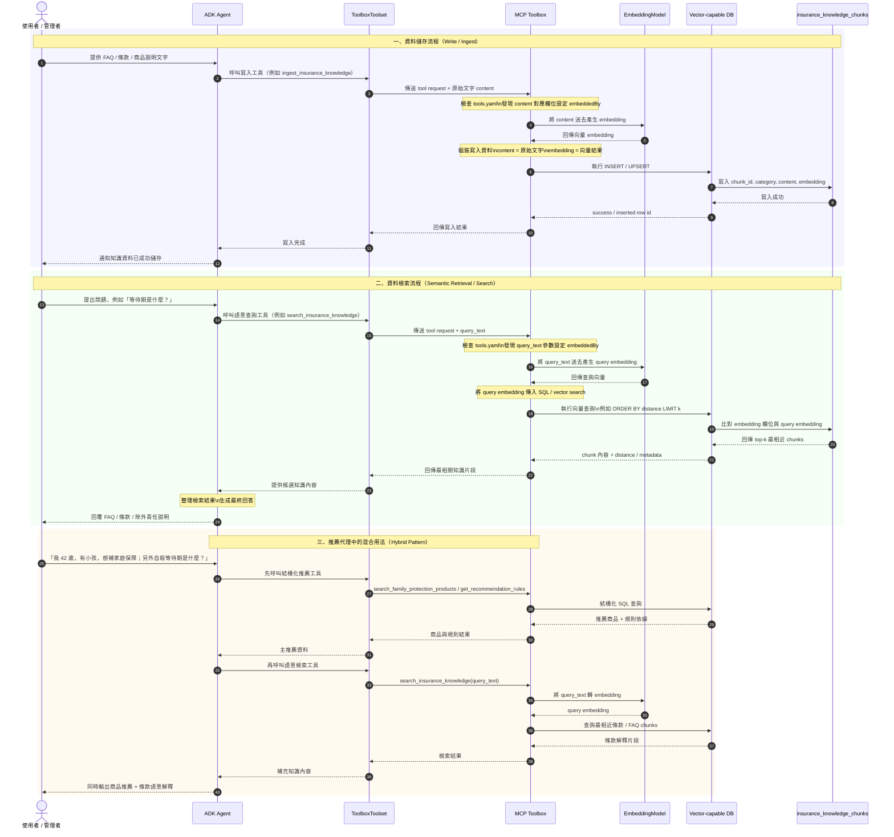
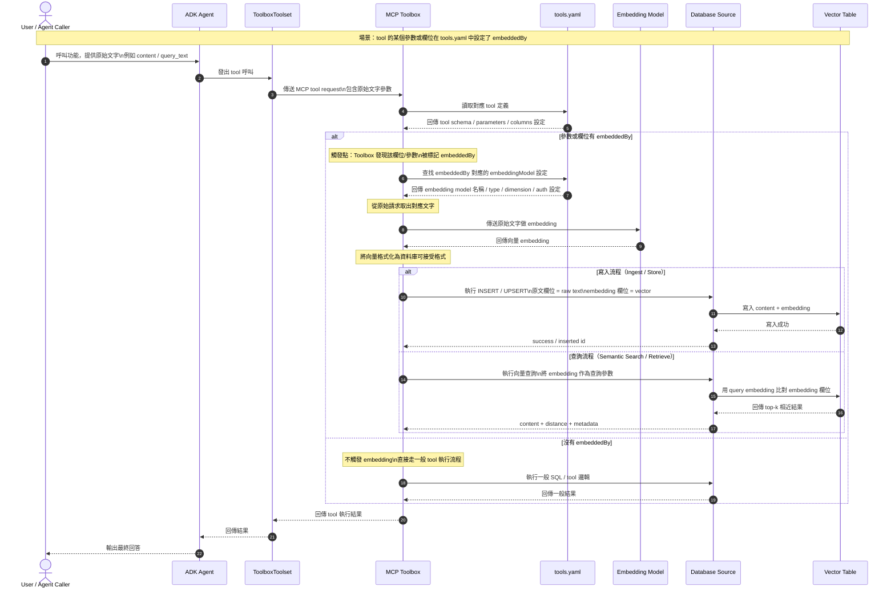

## Embedding 設計與目前結構化工具設計的差異

下面用表格整理 **目前設計** 與 **加入 embedding 設計** 的功能差異，並附上保險推薦代理的實際範例。

目前你的專案是以 **`tools.yaml + ToolboxToolset + 結構化 SQL tools`** 為主；這很適合做年齡、預算、保障目標、規則依據這類明確條件的推薦。MCP Toolbox 官方配置也把 `source`、`tool`、`toolset`、`prompt` 視為核心配置能力；另外也保留了 `embeddingModels` 與向量／檢索相關能力，適合延伸到語意搜尋與知識輔助場景。

| 面向                 | 目前設計：結構化工具 / SQL 型                | embedding 設計：語意檢索 / 向量型            | 保險代理範例                                                                                           |
| ------------------ | --------------------------------- | ---------------------------------- | ------------------------------------------------------------------------------------------------ |
| 核心目的               | 依明確條件做**可控篩選**                    | 依語意相似度做**相關內容召回**                  | 目前：依年齡 42、預算 30000、家庭保障找壽險；embedding：找「最像家庭責任保障」的條款或 FAQ 片段                                      |
| 最適合處理的問題           | 年齡、預算、商品類型、規則優先級這類**硬條件**         | 用戶自然語言問題、模糊需求、條款解釋、FAQ 問答這類**軟語意** | 目前：`search_family_protection_products`；embedding：搜尋「家庭責任、房貸、小孩教育費」相關知識片段                         |
| 推薦商品主流程            | 很適合當主流程                           | 不建議單獨當主流程                          | 主推薦仍應由 SQL tool 決定可投保候選；embedding 可輔助解釋為何這商品適合                                                   |
| 對輸入格式要求            | 較高，需要明確欄位                         | 較低，可接受模糊句子                         | 目前要知道 age / budget / goal；embedding 可處理「我怕突然生病影響家庭收入」                                            |
| 可解釋性               | 高，因為可回溯到 SQL 條件與規則表               | 中等，因為是相似度召回，需額外說明來源                | 目前可說「因為 age、budget、goal 符合」；embedding 可說「找到最相關 FAQ/條款」                                           |
| 結果穩定性              | 高                                 | 中到高，取決於 chunk、embedding model、檢索策略 | 同樣輸入，SQL 篩選通常更穩；embedding 可能因文本切分不同而有差異                                                          |
| 安全邊界               | 容易收斂，因為工具輸入輸出固定                   | 需多做內容治理，避免召回不相關或過時片段               | 目前只回指定欄位；embedding 可能召回不該優先展示的條文                                                                 |
| 最佳資料來源             | 結構化資料表                            | FAQ、條款、說明文件、長文本                    | `insurance_products` / `recommendation_rules` 適合目前設計；`faq_knowledge`、條款文件適合 embedding            |
| 與 MCP Toolbox 配置對應 | `source` + `tool` + `toolset` 已足夠 | 需要再用到 `embeddingModels` 與向量／檢索相關能力 | 目前你的 `tools.yaml` 已成熟；embedding 是下一層擴充方向                                                         |
| trace 與除錯          | 容易，因為看到明確 tool call 即可            | 較複雜，還要看檢索片段、相似度、chunk 命中           | 目前 trace 很清楚：`search_family_protection_products` → `get_recommendation_rules`；embedding 還要多看召回片段 |
| 典型輸出               | 商品候選、細節、規則依據                      | FAQ 答案、條款摘要、相關段落                   | 目前輸出「家庭定期壽險方案 C」；embedding 輸出「自殺等待期」或「既往症」相關說明                                                   |
| 是否需要大改既有架構         | 不需要，已完成                           | 不必推翻，只要加一層輔助工具                     | 建議保留現有主流程，embedding 只增強問答與說明                                                                     |
| 專案成熟度角色            | 主幹                                | 第二階段加值模組                           | 現在已可 demo；embedding 讓 demo 更像「懂條款的顧問」                                                            |

---

## 用保險代理來看，兩種設計最直觀的差異

| 使用情境          | 目前設計更適合 | embedding 設計更適合 | 例子                             |
| ------------- | ------- | --------------- | ------------------------------ |
| 找符合條件的商品      | 是       | 否               | 「我 30 歲，預算 15000，想加強醫療保障」      |
| 判斷是否符合年齡 / 預算 | 是       | 否               | 「42 歲、30000 預算是否能買家庭保障商品」      |
| 根據規則給主推薦      | 是       | 否               | 「有小孩優先考慮壽險」                    |
| 回答模糊問題        | 一般      | 是               | 「哪種保險比較像在保家庭生活不要中斷？」           |
| FAQ 問答        | 一般      | 是               | 「醫療險和意外險差在哪？」                  |
| 條款或除外責任說明     | 一般      | 是               | 「等待期是什麼？既往症會怎樣？」               |
| 找相似商品說明       | 一般      | 是               | 「有沒有跟家庭定期壽險方案 C 類似但更偏收入保障的內容？」 |
| 推薦後補充解釋       | 可做      | 很適合             | 推薦後再補「自殺等待期」「未誠實告知」相關條文說明      |

---

## 建議的最終分工

| 層次          | 建議使用         | 功能                                 |
| ----------- | ------------ | ---------------------------------- |
| 主推薦層        | 目前設計         | 根據 age / budget / goal / rules 選商品 |
| 商品細節層       | 目前設計         | 查等待期、除外條款、保費範圍                     |
| 規則解釋層       | 目前設計         | 說明為何家庭保障優先壽險                       |
| FAQ / 條款問答層 | embedding 設計 | 回答模糊問題、條款差異、名詞解釋                   |
| 推薦後知識增強層    | embedding 設計 | 推薦商品後補充最相關 FAQ / 條款片段              |

---

## 具體範例對照

| 使用者問題                        | 目前設計會怎麼做                                                                    | embedding 設計可額外做什麼                 |
| ---------------------------- | --------------------------------------------------------------------------- | ---------------------------------- |
| 我 42 歲，已婚有小孩，預算 30000，想補家庭保障 | 用 `search_family_protection_products` 找商品，再用 `get_recommendation_rules` 補原因 | 再補充「家庭責任」「收入中斷」相關 FAQ 或條款摘要        |
| 我想買保險，幫我推薦                   | 先追問 age / budget / goal                                                     | 可理解模糊語氣，補問時更像顧問，例如先猜可能在意醫療、意外或家庭責任 |
| 醫療險跟意外險差在哪                   | 可以硬查 FAQ 表，但表達較死                                                            | 用語意檢索找最相關 FAQ 片段，回答更自然             |
| 等待期是什麼意思                     | 若有明確 FAQ 表可回                                                                | 很適合，用條款 / FAQ chunks 做語意檢索後摘要      |
| 這張壽險適不適合我現在有房貸的情況            | 目前可依 family protection 規則回答                                                 | 還可檢索「房貸、家庭支柱、收入中斷」相關知識片段輔助說明       |

---

## Embedding 時序圖

## Embedding 向量處理流程

## 結論

| 判斷                  | 建議                               |
| ------------------- | -------------------------------- |
| 主推薦引擎               | 繼續用你現在的 `tools.yaml` 結構化工具       |
| embedding 是否值得加     | 值得，但作為第二階段的**知識檢索增強**            |
| 最適合先加的 embedding 功能 | FAQ 語意檢索、條款 / 除外責任語意檢索           |
| 不建議先做的事             | 用 embedding 取代年齡 / 預算 / 目標的主篩選邏輯 |
