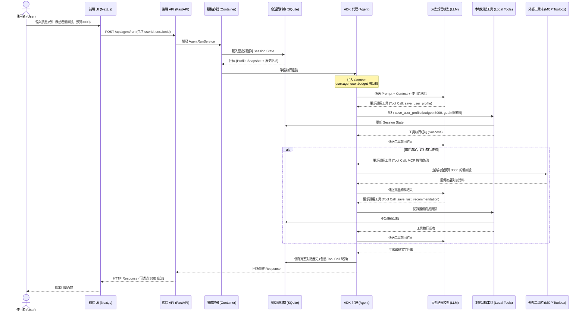

# 使用者到工具呼叫完整流程說明與流程圖 (User to Tool Call Flow)

## 系統架構與流程概述

本保險推薦智能助理 (Insurance Recommendation Agent) 的核心設計理念，是透過前端 (Next.js) 與後端 (Python FastAPI + Google ADK) 的密切配合，實現具備「長效記憶」與「狀態追蹤」的多輪對話體驗。

當使用者在前端發送訊息時，系統會進行一系列的狀態解析、工具調用 (Tool Calling) 以及模型推論，最終返回合適的保險建議。以下將詳細拆解從使用者輸入到工具呼叫的完整流程。

---

## 完整互動流程說明

### 1. 前端請求發起 (Frontend Request)
* **起點**：使用者在前端網頁 (`adk-workbench.tsx` 或對話介面) 輸入訊息。
* **動作**：前端應用程式透過 Next.js 的 API Route (例如 `frontend/app/api/apps/[appName]/users/[userId]/sessions/[sessionId]/route.ts`) 封裝使用者的訊息、使用者 ID (User ID) 以及對話階段 ID (Session ID)。
* **傳輸**：前端將封裝好的 JSON Payload 透過 HTTP POST 請求發送至後端 FastAPI 伺服器的推論端點 (`/api/routes/run.py` 或類似的 Agent 執行端點)。

### 2. 後端請求接收與會話初始化 (Backend Receiving & Session Init)
* **接收**：FastAPI 應用程式接收到請求。
* **容器化服務**：透過 `AppContainer` (`app/container.py`)，系統實例化或取得對應的服務，包含 `AgentRunService`、`SessionService` 以及設定好的 `Agent` (`app/agent.py`)。
* **會話載入**：系統根據傳入的 Session ID，從資料庫 (由 `ADK_SESSION_DB_URI` 指定的 SQLite 或其他 DB) 中載入該次對話的歷史紀錄以及 **Session State (狀態快照)**。

### 3. 上下文注入與提示詞建構 (Context Injection & Prompting)
* **狀態讀取**：系統讀取 `app/session_state.py` 中定義的追蹤鍵值 (Tracked Profile State Keys)，例如 `user:age`, `user:budget`, `user:main_goal` 等。
* **上下文注入 (Inject Context)**：在將請求送交給 LLM (大型語言模型) 之前，系統會將已知的 User Profile 資料動態注入到 System Prompt 或對話上下文中。這樣可以確保模型「記住」使用者先前的資訊，避免重複詢問。

### 4. 模型推論與工具決策 (LLM Inference & Tool Decision)
* **模型思考**：LLM (如 gemini-3-flash-preview) 接收到包含系統提示詞、User Profile 快照以及最新使用者訊息的請求。
* **判斷意圖**：模型根據上下文與對話進度，判斷當前需要執行什麼動作：
  * **情境 A (缺少資訊)**：如果 Profile 尚未收集完整，模型決定直接回覆使用者，詢問缺失的資訊。
  * **情境 B (資訊更新)**：如果使用者提供了新的屬性（例如：「我預算改為 5000」），模型決定調用 `save_user_profile` 工具。
  * **情境 C (滿足推薦條件)**：如果 Profile 已足夠，模型決定調用 MCP (ToolboxToolset) 內的外部工具去搜尋保險產品。

### 5. 工具呼叫執行 (Tool Execution)
* **執行本地工具 (Local Tools)**：
  * `save_user_profile`：將使用者提供的新條件寫入 Session State。
  * `get_user_profile_snapshot`：主動獲取當前所有已知屬性（有時模型會主動調用以確認狀態）。
  * `save_last_recommendation`：將剛決定的推薦商品 ID 與名稱存入 State。
  * `clear_last_recommendation`：清除先前的推薦狀態。
* **執行外部工具 (MCP Toolbox)**：
  * 透過 `ToolboxToolset` (`protocol=Protocol.MCP_LATEST`)，向外部的 MCP 伺服器 (由 `TOOLBOX_SERVER_URL` 指定) 發起請求，例如查詢特定條件的保險產品資料庫。
* **結果回傳模型**：工具執行完畢後，執行結果 (例如：成功儲存狀態、外部資料庫的查詢結果) 會回傳給 LLM 進行二次推論。

### 6. 生成最終回覆與狀態持久化 (Response Generation & Persistence)
* **生成回覆**：LLM 根據工具回傳的結果，生成最終的人類易讀回覆（例如：「我已幫您將預算調整為 5000，並為您推薦以下產品...」）。
* **狀態儲存**：`SessionService` 將更新後的對話歷史 (包含 Tool Calls) 與 Session State 寫回資料庫 (`adk_sessions.db`)。
* **回傳前端**：FastAPI 將最終的文字回覆（可能包含 SSE 串流傳輸）回傳給 Next.js 前端，展示給使用者。

---

## 互動流程圖 (Mermaid Sequence Diagram)

